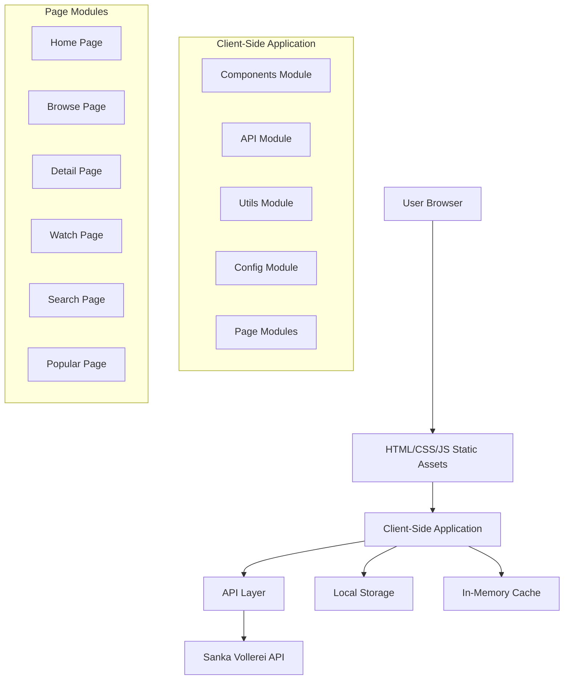
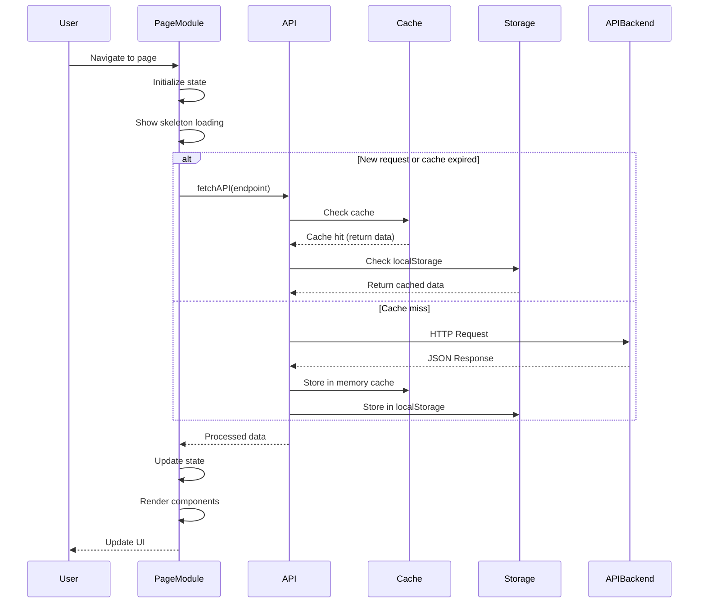

# Design Document: roxy-drachin C-Drama Streaming Platform

## Overview

roxy-drachin is a static website for streaming Chinese dramas built with HTML5, CSS3, and Vanilla JavaScript (ES6+). The platform integrates with the Sanka Vollerei API to provide content including drama listings, episode streaming, search functionality, and user engagement features. The implementation follows a modular architecture with clear separation of concerns across components, API integration, utilities, and page-specific logic. The design emphasizes performance, maintainability, and a responsive user experience across mobile and desktop devices.

## Architecture

### System Architecture



### Data Flow



## Components and Interfaces

### Components Module (`js/components.js`)

**Purpose**: Centralized UI component rendering functions

**Interface**:
```pascal
MODULE Components
  EXPORTS:
    renderDramaCard(drama, options): String
    renderSkeletonCard(count): String
    renderErrorState(message, retryCallback): String
    renderEmptyState(title, subtitle, actionHTML): String
    renderNavbar(currentPage): String
    renderSlider(slides, options): String
    renderEpisodeList(episodes, currentEpisode): String
    renderBadge(text, type): String
    showToast(message, type): Void
    formatEpisodeLabel(index): String
    initComponents(): Void
END MODULE
```

**Responsibilities**:
- Render drama cards with optional rank and badge
- Generate skeleton loading states
- Handle error and empty states
- Render navigation bar with active page detection
- Create hero slider with autoplay and swipe support
- Display toast notifications
- Format episode labels

### API Module (`js/api.js`)

**Purpose**: Centralized API integration with caching, rate limiting, and error handling

**Interface**:
```pascal
MODULE DrachinAPI
  EXPORTS:
    getHome(): Promise<Object>
    getLatest(page): Promise<Object>
    getPopular(page): Promise<Object>
    search(query): Promise<Object>
    getDetail(slug): Promise<Object>
    getEpisode(slug, index): Promise<Object>
    clearCache(): Void
    getCacheStats(): Object
END MODULE
```

**Responsibilities**:
- Execute API requests to Sanka Vollerei API
- Implement in-memory caching with TTL
- Enforce rate limiting (50 requests/minute)
- Handle HTTP errors and timeouts
- Provide cache statistics and management

### Utils Module (`js/utils.js`)

**Purpose**: Utility functions for common operations

**Interface**:
```pascal
MODULE Utils
  EXPORTS:
    debounce(fn, delay): Function
    truncate(text, maxLength, suffix): String
    getQueryParam(key): String
    setPageTitle(title): Void
    formatEpisodeLabel(index): String
    handleImageError(imgEl): Void
    formatDate(dateString): String
    formatNumber(num): String
    generateSlug(text): String
    isInViewport(element): Boolean
    scrollToElement(element, offset): Void
    copyToClipboard(text): Promise<Boolean>
    uniqueBy(arr, key): Array
    shuffleArray(array): Array
    getRandomItem(array): Any
    isEmptyObject(obj): Boolean
    deepClone(obj): Object
    throttle(fn, limit): Function
    getBrowserLanguage(): String
    isMobileDevice(): Boolean
    getViewportCategory(): String
    debouncePromise(fn, delay): Function
    waitForElement(selector, timeout): Promise<Element>
    loadFont(fontFamily, fontUrl): Promise<Void>
    formatDuration(seconds): String
    generateId(prefix): String
    safeParseJSON(str, defaultValue): Any
    isValidUrl(url): Boolean
    getFileExtension(url): String
    downloadFile(url, filename): Promise<Boolean>
    isUserIdle(timeout): Boolean
    getScrollPosition(): Object
    hasClass(element, className): Boolean
    addClass(element, className): Void
    removeClass(element, className): Void
    toggleClass(element, className, force): Void
END MODULE
```

**Responsibilities**:
- Debounce and throttle functions
- Text formatting and truncation
- URL parameter handling
- Image error handling with fallback
- Date and number formatting
- DOM utilities (viewport, scroll, classes)
- Clipboard operations
- Array utilities (unique, shuffle, random)
- Object utilities (clone, empty check)
- Async utilities (promise debounce, element wait)
- Font loading
- File operations
- User activity detection

### Config Module (`js/config.js`)

**Purpose**: Global configuration constants

**Interface**:
```pascal
MODULE Config
  EXPORTS:
    API_CONFIG: Object
    APP_CONFIG: Object
    SELECTORS: Object
    CSS_CLASSES: Object
    STORAGE_KEYS: Object
    ERROR_MESSAGES: Object
    SUCCESS_MESSAGES: Object
END MODULE
```

**Responsibilities**:
- Define API configuration (base URL, timeout, rate limit, cache TTL)
- Define application constants (max slides, items per page, slider settings)
- Define DOM selectors
- Define CSS class names
- Define localStorage keys
- Define error and success messages

## Data Models

### Drama Model

```pascal
STRUCTURE Drama
  title: String
  slug: String
  poster: String
  rating: Number (optional)
  episodes: Number (optional)
  genres: Array[String]
  year: Number (optional)
  status: String (optional)
  synopsis: String (optional)
  recommendations: Array[Drama] (optional)
  episodes_list: Array[Episode] (optional)
END STRUCTURE
```

**Validation Rules**:
- `title` is required and non-empty
- `slug` is required and unique
- `poster` uses fallback image if null
- `genres` is an array with max 5 items displayed
- `rating` is between 0.0 and 10.0
- `year` is a valid year (1900-2099)

### Episode Model

```pascal
STRUCTURE Episode
  slug: String
  index: Number
  title: String (optional)
  video_url: String (optional)
  url: String (optional)
  stream_url: String (optional)
END STRUCTURE
```

**Validation Rules**:
- `slug` is required and matches drama slug
- `index` is a positive integer
- At least one URL field is required (video_url, url, or stream_url)

### Home Data Model

```pascal
STRUCTURE HomeData
  slider: Array[Slide]
  latest: Array[Drama]
  popular: Array[Drama]
  recommendations: Array[Drama]
END STRUCTURE

STRUCTURE Slide
  title: String
  slug: String
  poster: String
  synopsis: String
  year: Number (optional)
  rating: Number (optional)
  genres: Array[String]
END STRUCTURE
```

### Search Results Model

```pascal
STRUCTURE SearchResults
  data: Array[Drama]
  total: Number (optional)
  page: Number (optional)
END STRUCTURE
```

## Algorithmic Pseudocode

### Main Application Initialization

```pascal
ALGORITHM initializeApplication
INPUT: None
OUTPUT: None

BEGIN
  // Wait for DOM to be ready
  ON DOMContentLoaded DO
    // Get current page from data-page attribute
    currentPage ← document.body.dataset.page
    
    // Initialize components
    initComponents()
    
    // Load page-specific logic
    SELECT currentPage
      CASE 'home':
        initHome()
      CASE 'browse':
        initBrowse()
      CASE 'detail':
        initDetail()
      CASE 'watch':
        initWatch()
      CASE 'search':
        initSearch()
      CASE 'popular':
        initPopular()
    END SELECT
  END ON
END
```

**Preconditions:**
- DOM is fully loaded
- All JavaScript modules are loaded
- CSS stylesheets are applied

**Postconditions:**
- Page-specific initialization functions are called
- Event listeners are attached
- Initial data is loaded

### API Request with Caching

```pascal
ALGORITHM fetchAPI(endpoint)
INPUT: endpoint - API endpoint path (without base URL)
OUTPUT: data - Parsed JSON response

BEGIN
  // Construct full URL
  url ← API_CONFIG.BASE_URL + endpoint
  cacheKey ← url
  
  // Check in-memory cache
  IF cache.has(cacheKey) THEN
    cached ← cache.get(cacheKey)
    IF isNotExpired(cached.timestamp) THEN
      RETURN cached.data
    END IF
    cache.delete(cacheKey)
  END IF
  
  // Check rate limit
  IF isRateLimitExceeded() THEN
    RAISE Error(ERROR_MESSAGES.RATE_LIMIT)
  END IF
  
  // Record request timestamp
  recordRequest()
  
  // Create abort controller for timeout
  controller ← new AbortController()
  timeoutId ← setTimeout(() → controller.abort(), API_CONFIG.TIMEOUT)
  
  TRY
    // Make HTTP request
    response ← fetch(url, {
      signal: controller.signal,
      headers: {
        'Accept': 'application/json',
        'User-Agent': 'roxy-drachin/1.0.0'
      }
    })
    
    clearTimeout(timeoutId)
    
    // Check response status
    IF NOT response.ok THEN
      IF response.status = 404 THEN
        RAISE Error(ERROR_MESSAGES.NOT_FOUND)
      ELSE IF response.status = 500 THEN
        RAISE Error(ERROR_MESSAGES.SERVER_ERROR)
      ELSE IF response.status = 429 THEN
        RAISE Error(ERROR_MESSAGES.RATE_LIMIT)
      ELSE
        RAISE Error(ERROR_MESSAGES.INVALID_RESPONSE + ' (Status: ' + response.status + ')')
      END IF
    END IF
    
    // Parse JSON response
    data ← await response.json()
    
    // Validate response structure
    IF data = null OR typeof data ≠ 'object' THEN
      RAISE Error(ERROR_MESSAGES.INVALID_RESPONSE)
    END IF
    
    // Cache the response
    cache.set(cacheKey, {
      data: data,
      timestamp: Date.now()
    })
    
    RETURN data
    
  CATCH error
    clearTimeout(timeoutId)
    cache.delete(cacheKey)
    
    IF error.name = 'AbortError' THEN
      RAISE Error(ERROR_MESSAGES.TIMEOUT)
    END IF
    
    RE-THROW error
  END TRY
END
```

**Preconditions:**
- Network connection is available
- Rate limit has not been exceeded
- API endpoint is valid

**Postconditions:**
- Response is cached for future requests
- Error is thrown if request fails
- Data is returned if successful

**Loop Invariants:**
- Cache consistency is maintained throughout execution
- Rate limiting is enforced for all requests

### Drama Card Rendering

```pascal
ALGORITHM renderDramaCard(drama, options)
INPUT: 
  drama - Drama object with title, slug, poster, rating, episodes, genres, year, status
  options - Render options (showRank, showBadge, badgeText, rank, isHorizontal)
OUTPUT: html - HTML string for drama card

BEGIN
  // Extract drama properties
  title ← drama.title
  slug ← drama.slug
  poster ← drama.poster OR ''
  rating ← drama.rating
  episodes ← drama.episodes
  genres ← drama.genres.slice(0, 2)
  year ← drama.year
  status ← drama.status
  
  // Generate poster URL with fallback
  posterUrl ← poster OR fallbackImageURL
  
  // Format genres (join first 2)
  genreList ← genres.join(', ')
  
  // Determine card classes
  IF options.isHorizontal THEN
    cardClasses ← 'drama-card drama-card-horizontal'
  ELSE
    cardClasses ← 'drama-card'
  END IF
  
  // Generate rank badge
  IF options.showRank AND options.rank ≠ null THEN
    rankBadge ← '<div class="drama-card-rank">' + options.rank + '</div>'
  ELSE
    rankBadge ← ''
  END IF
  
  // Generate badge
  IF options.showBadge THEN
    badge ← '<div class="drama-card-badge">' + options.badgeText + '</div>'
  ELSE
    badge ← ''
  END IF
  
  // Generate rating stars
  IF rating THEN
    ratingStars ← '<span class="drama-card-rating">★ ' + rating + '</span>'
  ELSE
    ratingStars ← ''
  END IF
  
  // Generate episode count
  IF episodes THEN
    episodeCount ← '<span class="drama-card-episodes">' + episodes + ' eps</span>'
  ELSE
    episodeCount ← ''
  END IF
  
  // Generate status badge
  IF status THEN
    statusBadge ← '<span class="drama-card-status">' + status + '</span>'
  ELSE
    statusBadge ← ''
  END IF
  
  // Build card HTML
  html ← '<div class="' + cardClasses + '" data-slug="' + slug + '">'
  html ← html + rankBadge
  html ← html + badge
  html ← html + '<div class="drama-card-image-wrapper">'
  html ← html + ''
  html ← html + '<div class="drama-card-overlay">'
  html ← html + '<h3 class="drama-card-title">' + title + '</h3>'
  html ← html + '<div class="drama-card-meta">'
  html ← html + '<span>' + genreList + '</span>'
  html ← html + '<span>' + year + '</span>'
  html ← html + '</div>'
  html ← html + '</div>'
  html ← html + '</div>'
  html ← html + '</div>'
  
  RETURN html
END
```

**Preconditions:**
- `drama` object is well-formed
- `options` object has correct structure

**Postconditions:**
- HTML string is returned with proper escaping
- Image error handling is included

### Hero Slider Initialization

```pascal
ALGORITHM initSlider
INPUT: None
OUTPUT: None

BEGIN
  // Get slider element
  slider ← document.querySelector('.hero-slider')
  
  IF slider = null THEN
    RETURN
  END IF
  
  // Get slider elements
  slides ← slider.querySelectorAll('.hero-slide')
  dots ← slider.querySelectorAll('.slider-dot')
  prevBtn ← slider.querySelector('.slider-btn-prev')
  nextBtn ← slider.querySelector('.slider-btn-next')
  
  // Initialize state
  currentIndex ← 0
  autoPlayInterval ← null
  autoPlay ← slider.dataset.autoplay = 'true'
  interval ← parseInt(slider.dataset.interval) OR 5000
  
  // Update active slide function
  FUNCTION updateSlide(index)
    FOR i ← 0 TO slides.length - 1 DO
      IF i = index THEN
        slides[i].classList.add(CSS_CLASSES.ACTIVE)
      ELSE
        slides[i].classList.remove(CSS_CLASSES.ACTIVE)
      END IF
    END FOR
    
    FOR i ← 0 TO dots.length - 1 DO
      IF i = index THEN
        dots[i].classList.add(CSS_CLASSES.ACTIVE)
      ELSE
        dots[i].classList.remove(CSS_CLASSES.ACTIVE)
      END IF
    END FOR
    
    currentIndex ← index
  END FUNCTION
  
  // Next slide function
  FUNCTION nextSlide()
    newIndex ← (currentIndex + 1) MOD slides.length
    updateSlide(newIndex)
  END FUNCTION
  
  // Previous slide function
  FUNCTION prevSlide()
    newIndex ← (currentIndex - 1 + slides.length) MOD slides.length
    updateSlide(newIndex)
  END FUNCTION
  
  // Start auto play function
  FUNCTION startAutoPlay()
    IF autoPlay THEN
      stopAutoPlay()
      autoPlayInterval ← setInterval(nextSlide, interval)
    END IF
  END FUNCTION
  
  // Stop auto play function
  FUNCTION stopAutoPlay()
    IF autoPlayInterval ≠ null THEN
      clearInterval(autoPlayInterval)
      autoPlayInterval ← null
    END IF
  END FUNCTION
  
  // Event listeners
  IF prevBtn ≠ null THEN
    prevBtn.addEventListener('click', prevSlide)
  END IF
  
  IF nextBtn ≠ null THEN
    nextBtn.addEventListener('click', nextSlide)
  END IF
  
  dots.forEach((dot, index) →
    dot.addEventListener('click', () → updateSlide(index))
  )
  
  // Pause on hover
  slider.addEventListener('mouseenter', stopAutoPlay)
  slider.addEventListener('mouseleave', startAutoPlay)
  
  // Start auto play
  startAutoPlay()
  
  // Mobile swipe support
  touchStartX ← 0
  touchEndX ← 0
  
  slider.addEventListener('touchstart', (e) →
    touchStartX ← e.changedTouches[0].screenX
  )
  
  slider.addEventListener('touchend', (e) →
    touchEndX ← e.changedTouches[0].screenX
    handleSwipe()
  )
  
  FUNCTION handleSwipe()
    swipeThreshold ← 50
    IF touchEndX < touchStartX - swipeThreshold THEN
      nextSlide()
    END IF
    IF touchEndX > touchStartX + swipeThreshold THEN
      prevSlide()
    END IF
  END FUNCTION
END
```

**Preconditions:**
- Slider element exists in DOM
- All slide elements are rendered
- Event listeners can be attached

**Postconditions:**
- Slider autoplay is started
- Navigation buttons work
- Dots navigation works
- Swipe support is enabled

**Loop Invariants:**
- Current index is always valid (0 ≤ currentIndex < slides.length)
- Active classes are synchronized between slides and dots

### Search with Debounce

```pascal
ALGORITHM createDebouncedSearch(callback)
INPUT: callback - Function to call with search results
OUTPUT: debouncedFunction - Debounced search function

BEGIN
  FUNCTION debouncedFunction(query)
    // Use debounce utility with 500ms delay
    debouncedCallback ← debounce(async (q) →
      TRY
        results ← await DrachinAPI.search(q)
        callback(results)
      CATCH error
        console.error('Search error:', error)
        callback({ data: [], error: error.message })
      END TRY
    , 500)
    
    debouncedCallback(query)
  END FUNCTION
  
  RETURN debouncedFunction
END
```

**Preconditions:**
- `callback` function is valid
- DrachinAPI.search is available

**Postconditions:**
- Debounced search function is returned
- Search is executed with 500ms delay

## Key Functions with Formal Specifications

### Function 1: debounce()

```pascal
FUNCTION debounce(fn, delay)
INPUT: 
  fn - Function to debounce
  delay - Delay in milliseconds
OUTPUT: Function - Debounced function

PRECONDITIONS:
  - fn is a callable function
  - delay is a non-negative integer

POSTCONDITIONS:
  - Returns a new function
  - When called, delays execution of fn by delay milliseconds
  - If called again within delay, resets the timer
  - Only the last call within a burst will execute

LOOP INVARIANTS:
  - timeoutId is cleared on each call
  - fn is only executed when timer expires
```

### Function 2: renderDramaCard()

```pascal
FUNCTION renderDramaCard(drama, options)
INPUT:
  drama - Drama object with required fields
  options - Render options object
OUTPUT: String - HTML string for drama card

PRECONDITIONS:
  - drama.title is a non-empty string
  - drama.slug is a valid string identifier
  - options is an object (may be empty)

POSTCONDITIONS:
  - Returns valid HTML string
  - Image has onerror handler for fallback
  - Data attributes are properly set
  - Optional elements are conditionally rendered

LOOP INVARIANTS:
  - All string concatenations are safe
  - No XSS vulnerabilities in output
```

### Function 3: fetchAPI()

```pascal
FUNCTION fetchAPI(endpoint)
INPUT: endpoint - API endpoint path
OUTPUT: Promise - Resolves with parsed JSON data

PRECONDITIONS:
  - endpoint is a valid API path
  - Network connection is available
  - Rate limit has not been exceeded

POSTCONDITIONS:
  - Returns Promise that resolves with data
  - Response is cached in memory
  - Errors are properly handled and re-thrown
  - Cache TTL is respected

LOOP INVARIANTS:
  - Cache is consistent across requests
  - Rate limiting is enforced
  - Timeout is properly managed
```

### Function 4: initSlider()

```pascal
FUNCTION initSlider()
INPUT: None
OUTPUT: None

PRECONDITIONS:
  - Hero slider element exists in DOM
  - Slide elements are rendered
  - Event listeners can be attached

POSTCONDITIONS:
  - Slider autoplay is initialized
  - Navigation buttons work correctly
  - Dots navigation works correctly
  - Swipe support is enabled

LOOP INVARIANTS:
  - Current index is always valid
  - Active classes are synchronized
  - Auto-play timer is properly managed
```

## Example Usage

### Basic Page Initialization

```pascal
SEQUENCE
  // Wait for DOM to be ready
  ON DOMContentLoaded DO
    // Get current page from data-page attribute
    currentPage ← document.body.dataset.page
    
    // Initialize components
    initComponents()
    
    // Load page-specific logic
    SELECT currentPage
      CASE 'home':
        initHome()
      CASE 'browse':
        initBrowse()
      CASE 'detail':
        initDetail()
      CASE 'watch':
        initWatch()
      CASE 'search':
        initSearch()
      CASE 'popular':
        initPopular()
    END SELECT
  END ON
END SEQUENCE
```

### API Request with Error Handling

```pascal
SEQUENCE
  TRY
    // Get home data
    homeData ← await DrachinAPI.getHome()
    
    // Extract data from response
    slider ← homeData.slider OR []
    latest ← homeData.latest OR []
    popular ← homeData.popular OR []
    recommendations ← homeData.recommendations OR []
    
    // Render components
    renderHeroSlider(slider)
    renderLatestDramas(latest)
    renderPopularDramas(popular)
    renderRecommendations(recommendations)
    
  CATCH error
    console.error('Error loading home data:', error)
    showToast(ERROR_MESSAGES.SERVER_ERROR, 'error')
    
    // Show error state
    heroSliderContainer.innerHTML ← renderErrorState(ERROR_MESSAGES.SERVER_ERROR, loadHomeData)
    latestGrid.innerHTML ← renderErrorState(ERROR_MESSAGES.SERVER_ERROR, loadHomeData)
    popularGrid.innerHTML ← renderErrorState(ERROR_MESSAGES.SERVER_ERROR, loadHomeData)
    recommendationGrid.innerHTML ← renderErrorState(ERROR_MESSAGES.SERVER_ERROR, loadHomeData)
  END TRY
END SEQUENCE
```

### Search with Debounce

```pascal
SEQUENCE
  // Create debounced search handler
  debouncedSearchHandler ← debounce((event) →
    query ← event.target.value.trim()
    
    IF query.length ≥ 2 THEN
      // Prefetch search results
      DrachinAPI.search(query).catch(() → {})
    END IF
  , 500)
  
  // Add event listener to search input
  searchInput.addEventListener('input', debouncedSearchHandler)
END SEQUENCE
```

## Correctness Properties

### Property 1: Cache Consistency

**Universal Quantification**: For all API requests made within the cache TTL period, the cached response is returned instead of making a new network request.

**Formal Statement**: 
∀ endpoint ∈ API endpoints, ∀ t ∈ time, 
IF cache.has(endpoint) AND (current_time - cache_timestamp) < CACHE_TTL 
THEN fetchAPI(endpoint) = cache.get(endpoint).data

### Property 2: Rate Limit Enforcement

**Universal Quantification**: No more than 50 API requests are made within any 60-second window.

**Formal Statement**: 
∀ window ∈ time windows of 60 seconds, 
|{requests ∈ window}| ≤ 50

### Property 3: Image Fallback

**Universal Quantization**: All images that fail to load display a fallback SVG placeholder.

**Formal Statement**: 
∀ img ∈ images, 
IF img.onerror = true THEN img.src = fallbackImageURL

### Property 4: Slider State Synchronization

**Universal Quantification**: The active slide index is always synchronized with the active dot indicator.

**Formal Statement**: 
∀ i ∈ [0, slides.length), 
activeSlide(i) ↔ activeDot(i)

### Property 5: Search Debounce

**Universal Quantification**: Search requests are delayed by 500ms and only the last request in a burst is executed.

**Formal Statement**: 
∀ queries ∈ search burst, 
IF queries.length > 1 THEN 
  executed_query = last(queries) AND 
  delay(executed_query) = 500ms

## Error Handling

### Error Scenario 1: Network Failure

**Condition**: Network connection is unavailable or request times out
**Response**: Display error toast with message "Koneksi internet bermasalah. Silakan coba lagi."
**Recovery**: User can retry by clicking the retry button which re-executes the data loading function

### Error Scenario 2: API Rate Limiting

**Condition**: More than 50 requests are made within 60 seconds
**Response**: Throw error with message "Terlalu banyak permintaan. Silakan tunggu sebentar."
**Recovery**: Wait for rate limit window to reset, then retry request

### Error Scenario 3: Invalid API Response

**Condition**: API returns non-JSON response or unexpected structure
**Response**: Throw error with message "Respons server tidak valid."
**Recovery**: Clear cache and retry request

### Error Scenario 4: Image Load Failure

**Condition**: Image URL is invalid or image is unavailable
**Response**: Replace image source with fallback SVG placeholder
**Recovery**: No recovery needed - fallback is permanent

### Error Scenario 5: Video Unplayable

**Condition**: Video stream URL is invalid or video format is unsupported
**Response**: Display error state with message "Video tidak dapat diputar. Coba episode lain."
**Recovery**: User can navigate to another episode or return to detail page

## Testing Strategy

### Unit Testing Approach

**Test Coverage Goals**:
- Components module: 100% coverage for all render functions
- API module: 100% coverage for all endpoints and error cases
- Utils module: 100% coverage for all utility functions
- Page modules: 80% coverage for core functionality

**Key Test Cases**:
- `renderDramaCard()`: Verify HTML output for various drama objects
- `renderDramaCard()`: Verify rank badge rendering when showRank is true
- `renderDramaCard()`: Verify badge rendering when showBadge is true
- `fetchAPI()`: Verify cache hit returns cached data
- `fetchAPI()`: Verify cache miss makes network request
- `fetchAPI()`: Verify rate limiting throws error after 50 requests
- `debounce()`: Verify function is delayed by specified time
- `truncate()`: Verify text is truncated with suffix
- `handleImageError()`: Verify fallback image is set

### Property-Based Testing Approach

**Property Test Library**: fast-check

**Property 1: Cache Consistency**
```pascal
PROPERTY cacheConsistency
FORALL endpoint ∈ validEndpoints
  AND ttl ∈ [0, CACHE_TTL]
  AND data ∈ validData
DO
  // Setup: Cache data
  cache.set(endpoint, { data: data, timestamp: Date.now() - ttl })
  
  // Execute: Fetch API
  result ← await fetchAPI(endpoint)
  
  // Verify: Result matches cached data
  ASSERT result = data
END PROPERTY
```

**Property 2: Rate Limit Enforcement**
```pascal
PROPERTY rateLimitEnforcement
FORALL requests ∈ requestSequence WITH length = 51
DO
  // Execute: Make 51 requests
  TRY
    FOR request ∈ requests DO
      await fetchAPI(request.endpoint)
    END FOR
    success ← true
  CATCH error
    success ← false
    errorMessage ← error.message
  END TRY
  
  // Verify: 51st request should fail
  ASSERT success = false
  ASSERT errorMessage = ERROR_MESSAGES.RATE_LIMIT
END PROPERTY
```

**Property 3: Debounce Behavior**
```pascal
PROPERTY debounceBehavior
FORALL fn ∈ functions AND delay ∈ [100, 1000] AND calls ∈ callSequence
DO
  // Setup: Create debounced function
  debouncedFn ← debounce(fn, delay)
  
  // Execute: Call function multiple times
  FOR call ∈ calls DO
    debouncedFn()
  END FOR
  
  // Verify: Function is called only once after delay
  ASSERT fn.callCount = 1
END PROPERTY
```

### Integration Testing Approach

**Test Scenarios**:
- Home page loads with slider, latest, popular, and recommendations sections
- Browse page filters between latest and popular dramas
- Detail page displays drama information and episode list
- Watch page plays video and handles episode navigation
- Search page displays results with pagination
- Popular page shows trending dramas with ranking

**Test Tools**: Jest, Puppeteer

## Performance Considerations

### Performance Requirements

- Initial page load: < 2 seconds on 3G connection
- Time to interactive: < 3 seconds
- API response time: < 1 second (excluding network latency)
- Image loading: < 500ms for hero slider image
- Search debounce: 500ms delay

### Optimization Strategies

**Caching**:
- In-memory cache with 5-minute TTL for API responses
- localStorage for user preferences (theme, favorites)
- Browser caching for static assets (CSS, JS, images)

**Lazy Loading**:
- Images use `loading="lazy"` attribute
- Non-critical scripts loaded after main content
- Dynamic imports for page-specific modules

**Code Splitting**:
- Separate modules for components, API, utils, config
- Page-specific logic loaded only when needed
- Tree-shaking for unused exports

**Image Optimization**:
- Responsive images with appropriate sizes
- Fallback SVG for missing images
- Lazy loading for below-fold images

**API Optimization**:
- Request debouncing for search
- Rate limiting to prevent abuse
- Cache invalidation on errors

## Security Considerations

### Security Requirements

- Prevent XSS attacks in rendered content
- Validate all user inputs
- Sanitize API responses
- Secure storage of user preferences

### Threat Model

**Threat 1: Cross-Site Scripting (XSS)**
- **Mitigation**: Use template literals with proper escaping
- **Mitigation**: Sanitize user inputs before rendering
- **Mitigation**: Use Content Security Policy (CSP)

**Threat 2: Insecure API Communication**
- **Mitigation**: Use HTTPS for all API requests
- **Mitigation**: Validate API responses
- **Mitigation**: Implement request signing for sensitive operations

**Threat 3: Local Storage Abuse**
- **Mitigation**: Limit storage to non-sensitive data
- **Mitigation**: Implement storage size limits
- **Mitigation**: Clear storage on logout

**Threat 4: Rate Limit Bypass**
- **Mitigation**: Server-side rate limiting
- **Mitigation**: Client-side request throttling
- **Mitigation**: Implement CAPTCHA for suspicious activity

## Dependencies

### External Dependencies

- **Fonts**: Google Fonts (Playfair Display, Noto Sans)
- **API**: Sanka Vollerei API (https://api.sankavollerei.com)

### Internal Dependencies

- **CSS**: variables.css, base.css, components.css, pages.css
- **JavaScript**: ES6+ features (modules, async/await, arrow functions, template literals)
- **Browser APIs**: Fetch API, LocalStorage, MutationObserver, FontFace

### Browser Support

- Chrome/Edge: Full support
- Firefox: Full support
- Safari: Full support
- Mobile browsers: Full support (iOS Safari, Chrome Mobile)

---

## Implementation Notes

### Current Implementation Status

The roxy-drachin platform has been fully implemented with the following features:

**Completed Features**:
- API integration with Sanka Vollerei API
- Hero slider with auto-play and swipe support
- Responsive design (mobile-first)
- Multiple pages: home, browse, detail, watch, search, popular
- Loading states, error handling, toast notifications
- Search with debounce and pagination
- Image fallback handling
- Rate limiting and caching
- Skeleton loading states

**Future Enhancements**:
- User authentication and favorites
- Watch history tracking
- Theme customization
- Subtitle options
- Quality selection
- Social sharing
- Comment system
- Rating system